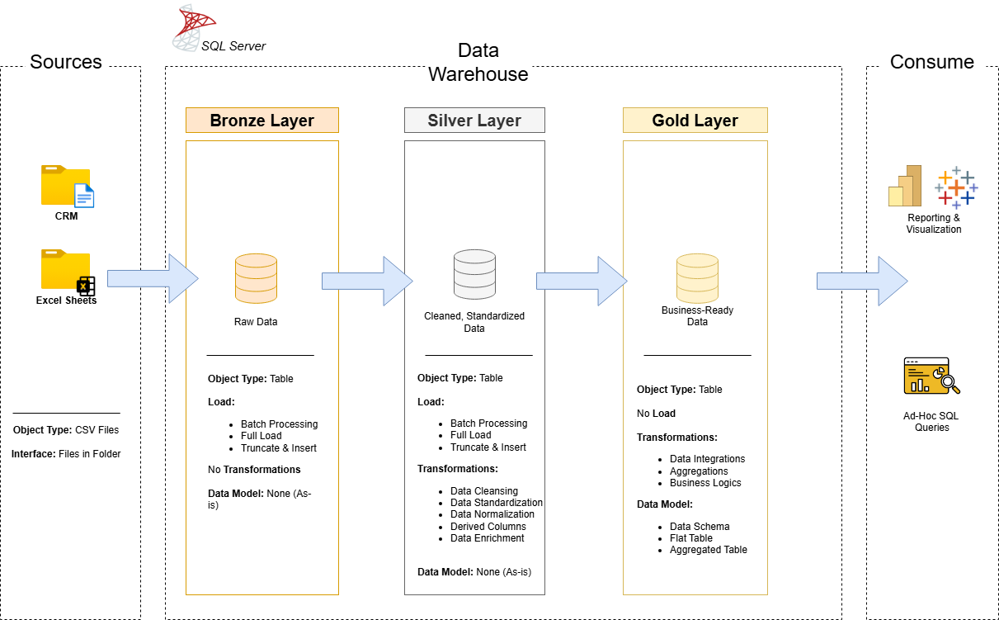

# Data Warehouse and Analytics Project
Building a data warehouse with SQL Server, including ETL processes, data modeling, and analytics for a small business.

Data Warehouse and Analytics Project
Welcome to the Data Warehouse and Analytics Project repository! 🚀
This project demonstrates a comprehensive data warehousing and analytics solution, from building a data warehouse to generating actionable insights. Designed as a portfolio project, it highlights industry best practices in data engineering and analytics.

🏗️ Data Architecture
The data architecture for this project follows Medallion Architecture Bronze, Silver, and Gold layers:

Bronze Layer: Stores raw data as-is from the source systems. Data is ingested from CSV Files into SQL Server Database.
Silver Layer: This layer includes data cleansing, standardization, and normalization processes to prepare data for analysis.
Gold Layer: Houses business-ready data modeled into a star schema required for reporting and analytics.

## 📖 Project Overview:
**[Notion](https://www.notion.com/templates/sql-data-warehouse-project](https://www.notion.so/Data-Warehouse-Project-1c4d85f9cd1e80368f38d6729e8e937d)](https://abiding-carbon-aae.notion.site/Data-Warehouse-Project-1c4d85f9cd1e80368f38d6729e8e937d)):** Access to All Project Phases and Tasks.
